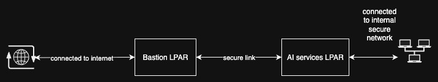

# Installing in air-gapped environment

This guide provides detailed instructions for installing the application in environments without external internet connectivity. It outlines the prerequisites, offline resource preparation, and deployment process.

## Environment Setup

Two machines are required to perform the installation in an air-gapped environment:

- **Bastion(Jump) LPAR**

    - A system with active internet connectivity used to download all required installation artifacts, container images, and dependencies.

    - Save and package all necessary files for offline use.

    - Transfer the downloaded resources to the air-gapped environment through internal network share.

- **AI Services LPAR**

    - The target deployment environment with no internet access.

    - Use local or internal repositories to perform the installation.

**Note: The machines should be network-accessible to each other.**

For the purpose of this tutorial, example IP addresses are used to illustrate the setup.
Replace these values with the actual IPs from your environment when performing the installation.

- Bastion LPAR:

    - Private Network: `192.168.0.94`

    - Public Network: `10.20.187.80`

- AI Services LPAR:

    - Private n/w: `192.168.0.39`


Fig 1.0 - Air-gapped environment

## Prerequisites

These steps must be executed on the bastion host (until mentioned otherwise), which acts as the intermediary system for fetching and preparing resources for the air-gapped environment.

### Proxy Configuration (Optional)

If the target workload operates in a semi-air-gapped environment or requires controlled outbound access (for example, through a Secure Proxy Access Relay – SPAR), configure a Squid proxy on the connected machine.

1. Install Squid

    ```$ yum install squid```

2. Start the Squid Service

    ```$ systemctl start squid```

3. Enable Squid on System Boot

    ```$ systemctl enable squid```

4. Verify Status

    ```$ systemctl status squid```

Once the Squid service is running, it will listen on port 3128 by default.

### Install Podman

1. Install Podman

    ```$ dnf install -y podman```

2. Verify the installation

    ```$ podman --version```

### Pull AI-services binary

Use the following `curl` command to download it (replace `<version>` with the desired release tag):

```bash
$ curl -LO https://example.com/ai-services/releases/download/<version>/<ai-services-binary>
$ sudo mv <ai-services-binary> /usr/local/bin/
$ sudo chmod +x <ai-services-binary>
```

**After the bastion host is prepared with the necessary prerequisites, begin downloading the assets needed for the target environment.**

## Download images and models

1. Pull the listed images

    ```$ ai-services application image pull --template <template_name>```

2. List the models used

    ```$ ai-services application model list --template <template_name>```

3. Download the models

    ```$ ai-services application model download --template <template_name>```

## Package the Downloaded Assets

Once all required assets have been downloaded on the bastion host, package them into compressed archives.
These archives will be used for transferring the assets to the target air-gapped environment.

1. Create TAR archive for images. Create a separate compressed archive for every image.

    ```$ podman save -o <image_1>.tar <image_name>:<image_tag>```

2. Create TAR archive for models

    ```$ tar -I pigz -cvf models.tar.gz /var/lib/ai-services/models```

## Transfer assets to target machines (AI Services LPAR)

Transfer the assets from the bastion host to the target air-gapped environment using secure media.(Replace the IP address, these are examples)

```bash
$ scp *.tar root@192.168.0.94:/root
$ scp models.tar.gz root@192.168.0.94:/root
$ scp <ai-services-binary> root@192.168.0.94:/root
```

## Deploying in air-gapped environment

The following steps should be run on the air-gapped environment i.e the target environment.

#### 1. Register to RHN (Optional)

  We register the target to Red Hat Network (RHN) through the Squid proxy created on the bastion. This is one supported approach; other registration methods may exist and are out of scope for this document.

  Open `/etc/rhsm/rhsm.conf` file and edit following settings:

```bash
#an http proxy server to use
proxy_hostname = 192.168.0.39

#port for http proxy server
proxy_port = 3128
```

#### 2. Setup AI services binary

```bash
$ sudo chmod +x <ai-services-binary>
$ sudo mv <ai-services-binary> /usr/local/bin/
```

#### 3. Load container images and models

  Import the pre-packaged container images and associated model artifacts into the air-gapped environment to make them available for deployment.

```bash
$ for file in *.tar; do podman load -i "$file"; done
$ tar -I pigz -xvf models.tar.gz -C /
```

#### 4. Create the application

  Create the application with flag `--skip-model-download`

```bash
ai-services application create test1 --template rag-air --skip-model-download
```
